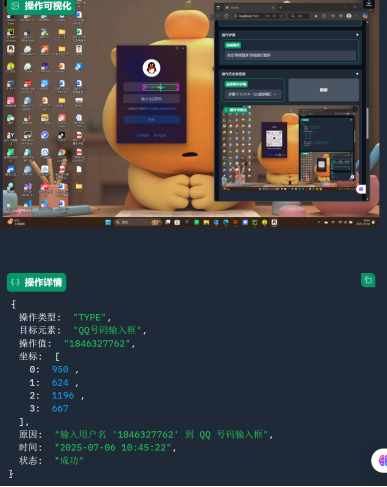

# 桌面自动化智能体系统

这是一个基于视觉理解的桌面自动化智能体系统，能够通过分析屏幕截图执行用户登录和网页搜索等任务。系统结合了大型视觉语言模型（Qwen2.5-VL）和桌面自动化技术，实现智能的桌面操作。

## 功能特点

- **智能视觉理解**：使用Qwen2.5-VL模型分析屏幕内容
- **自动化操作**：支持点击、输入、滚动等桌面操作
- **多任务支持**：实现用户登录和网页搜索功能
- **可视化界面**：提供直观的Gradio用户界面
- **错误恢复机制**：内置重试和错误处理逻辑

## 支持的应用

| 应用名称   | 登录功能 | 搜索功能 |
|------------|----------|----------|
| QQ         | ✓        |          |
| 微信       | ✓        |          |
| 钉钉       | ✓        |          |
| 联想浏览器 |          | ✓        |
| Edge       |          | ✓        |
| Firefox    |          | ✓        |


## 操作演示

以下是自动化操作的效果演示：

### 1. 双击打开QQ应用


### 2. 输入QQ号码



### 3. 输入QQ密码


## 安装指南

### 前提条件

- Python 3.8+
- NVIDIA GPU（推荐）
- Windows操作系统

### 安装步骤

1. **克隆仓库**：
    ```bash
    git clone https://github.com/daiwber/VisualAutoAgent.git
    cd VisualAutoAgent
    ```

2. **创建并激活虚拟环境**：
    ```bash
    python -m venv venv
    venv\Scripts\activate
    ```

3. **安装依赖**：
    ```bash
    pip install -r requirements.txt
    ```

4. **下载模型**：
    - 从Hugging Face下载Qwen2.5-VL-3B-Instruct模型。
    - 将模型放在`D:\Downloads\Model\Qwen2.5-VL-3B-Instruct`目录下。

## 使用说明

### 启动应用

python main.py

## 应用将在本地启动，访问地址：[http://localhost:7860](http://localhost:7860)

### 界面说明

- **任务选择**：选择"用户登录"或"网页搜索"任务。
- **应用选择**：选择目标应用（QQ、微信、浏览器等）。
- **凭据输入**：
  - 登录任务：输入用户名和密码。
  - 搜索任务：输入搜索关键词。
- **任务控制**：
  - 开始任务：启动自动化流程。
  - 暂停/继续：控制任务执行。
  - 停止任务：终止当前任务。
- **可视化区域**：显示屏幕截图和操作可视化。
- **操作历史**：查看已执行的操作记录。

### 执行任务

1. 选择任务类型（用户登录或网页搜索）。
2. 选择目标应用。
3. 输入必要信息（用户名/密码或搜索词）。
4. 点击"开始任务"按钮。
5. 观察自动化过程，系统将逐步执行任务。

### 注意事项

- **目标应用可见性**：
  - 确保目标应用在桌面上可见。
  - 保持应用为默认窗口大小。
  - 避免在自动化过程中操作鼠标键盘。
- **模型路径**：
  - 确保模型下载到指定路径：`D:\Downloads\Model\Qwen2.5-VL-3B-Instruct`。
  - 如需更改路径，修改`config.py`中的`MODEL_PATH`。
- **硬件要求**：
  - 推荐使用NVIDIA GPU运行。
  - 至少8GB显存。
  - 16GB以上内存。

### 项目结构

```
desktop-automation-agent/
├── agent/                  # 智能体核心逻辑
│   ├── init.py
│   └── desktop_automation.py
├── core/                   # 核心组件
│   ├── init.py
│   ├── operation.py        # 操作定义
│   ├── task_prompts.py     # 任务提示模板
│   └── task_state.py       # 任务状态管理
├── interface/              # 用户界面
│   ├── init.py
│   └── gradio_ui.py        # Gradio界面实现
├── models/                 # 模型相关
│   ├── init.py
│   └── qwen_vl_utils.py    # 模型加载和处理
├── utils/                  # 工具函数
│   ├── init.py
│   ├── image_processing.py # 图像处理
│   ├── screen_capture.py   # 屏幕捕获
│   └── visualization.py    # 可视化工具
├── config.py               # 配置文件
├── main.py                 # 主入口
└── requirements.txt        # 依赖列表
```


### 贡献指南

欢迎贡献代码！请遵循以下步骤：

1. Fork项目仓库。
2. 创建新分支：`git checkout -b feature/your-feature`。
3. 提交更改：`git commit -m 'Add some feature'`。
4. 推送到分支：`git push origin feature/your-feature`。
5. 提交Pull Request。

### 许可证

本项目采用 [MIT 许可证](https://github.com/yourusername/desktop-automation-agent/blob/main/LICENSE)。

### 联系方式

如有任何问题或建议，请联系：

- 邮箱：1846327762@qq.com


